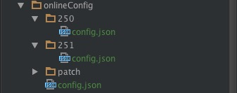

# 多表配置

使用全局配置表和指定版本配置表

## 配置文件的建立,如下图所示



上图有几个关键点

+ 主目录下及onlineConfig/config.json 代表全局配置，如果应用希望向所有版本配置参数就可以修改此文件

+ 250/config.json或251/config.json代表指定版本的配置文件，特定版本的配置文件只有指定版本会收到。比如250/config.json只有版本号为250的版本才能拉取这个配置文件。

+ 特定版本的配置文件与全局配置文件结构保持一致

+ 客户端将使用全局配置文件和当前版本的配置文件合成一个最终的配置文件,合成规则：

  + 如果没有当前版本配置文件的话直接采用全局配置文件
  + 当前版本的配置文件里的字段覆盖全局配置文件里的字段，注意是字段覆盖，及只要当前版本的配置文件有这个字段就采用，否则采用全局配置文件里的字段

   onlineConfig/config.json

```json
   {
     //字段可以根据需求添加
     "lastVersionCode" : 251,	//最新版本的版本号
     "minimumRequiredVersion": 251, //如果当前版本号小于此版本，引导强制更新
     "downloadUrl": "url",
     "releaseNotes": "应用更新说明，需要弹框",
     "apkSize": 20.6 ,
     "isUpdateOnlyWifi": true,

     //高级特性,按需添加
     "isDeltaUpdate": false, //增量更新
     "patches":[],	//补丁文件
     "isNeedRemovePatch": false,	//是否需要清除补丁
     "isSilentDownload": false,
     "apkMD5": "md5"
   }
```

   合成规则

```java
   private static OnlineConfig mergeConfig(OnlineConfig globalConfig, OnlineConfig versionConfig) {
        OnlineConfig mergedConfig = new OnlineConfig();
        if (globalConfig == null) {
            mergedConfig = versionConfig;
        } else if (versionConfig == null) {
            mergedConfig = globalConfig;
        } else {
            mergedConfig.setLastVersionCode(versionConfig.getLastVersionCode() > 0 ?
                    versionConfig.getLastVersionCode() : globalConfig.getLastVersionCode());
            mergedConfig.setDownloadUrl(versionConfig.getDownloadUrl() != null ?
                    versionConfig.getDownloadUrl() : globalConfig.getDownloadUrl());
            mergedConfig.setReleaseNotes(versionConfig.getReleaseNotes() != null ?
                    versionConfig.getReleaseNotes() : globalConfig.getReleaseNotes());
            mergedConfig.setMinimumRequiredVersion(versionConfig.getMinimumRequiredVersion() > 0 ?
                    versionConfig.getMinimumRequiredVersion() : globalConfig.getMinimumRequiredVersion());
            mergedConfig.setApkSize(versionConfig.getApkSize() > 0 ?
                    versionConfig.getApkSize() : globalConfig.getApkSize());
            mergedConfig.setIsUpdateOnlyWifi(versionConfig.isIsUpdateOnlyWifi() != null ?
                    versionConfig.isIsUpdateOnlyWifi() : globalConfig.isIsUpdateOnlyWifi());
        }

        return mergedConfig;
    }
```

+ 以上做法有几点好处，有全局配置和指定版本配置，就可以方便的实现大部分功能，比如说如果想强制更新所有版本，就可以直接在全局设置修改minimumRequiredVersion和lastVersionCode为最新的版本号，downloadUrl改为最新，当然还得删除指定版本里的这三个字段。

  又比如说如果想增量更新App或者想像指定版本打补丁，这时就需要修改指定版本的配置文件，因为每个版本需要的文件都是独特的

+ 获取到配置文件之后，就可以根据需求写出自己的判断逻辑了，简单的更新逻辑如下所示

```java
if (BuildConfig.VERSION_CODE < config.getMinimumRequiredVersion()) {
       showForceUpdate(context);
} else if (BuildConfig.VERSION_CODE < config.getLastVersionCode()) {
       if (!hasShownUpdateDialog) {
         showUpdateDialog(config);
         hasShownUpdateDialog = true;
       }
 }
```


## 推荐配置

虽然全局配置和版本控制字段一样，理论上可以对随便搭配，但建议所有版本的更新相关的字段都只在全局配置里写，补丁或者增量更新包只在版本配置里写，这样不容易造成混乱。当然如果只需要更新指定版本时一定要特别注意未来的修改。


